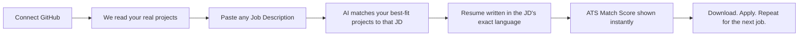

<div align="center">

# beATS

### Your resume was never rejected by a human. It was rejected by a bot that can't read.

[](#)
[](#)
[](#)

</div>

---

## The Problem

You spent three months building a project you're proud of.

You applied to 40 jobs with the same resume.

You got 2 replies.

Here's what actually happened to the other 38: a bot called an **ATS (Applicant Tracking System)** opened your resume, scanned it for keywords that matched the job description, didn't find enough of them, and quietly moved you to the "Rejected" pile — before a single human being ever saw your name.

It didn't matter that you built a working RAG pipeline. It didn't matter that you shipped a full-stack app with real users. If the words on your resume didn't match the words in the job posting, the bot didn't care.

And the worst part? You keep sending that **exact same resume** to every job — the same bullet points, the same three projects, the same phrasing — no matter what the role actually asks for.

You're not being rejected for lack of skill. You're being rejected for a mismatch that takes five minutes to fix — if you had five minutes to spend on every single application, which nobody does.

**So I built something that does it for you.**

---

## What beATS Actually Does



No templates to fill in by hand. No guessing which project to highlight. No sending the same resume 40 times and hoping.

You connect your GitHub once. Every time you paste a new job description, beATS looks at **all** your repositories, picks the ones that are genuinely most relevant to *that specific role*, and writes a resume using the same language and keywords the job posting uses — because that's what the bot is actually scanning for.

---

## How It Works, Under the Hood

<table>
<tr>
<td width="50%" valign="top">

### 1. GitHub → Signal
We don't just list your repos. We pull the README, the dependency files, the language breakdown, the topics — and ask an AI to summarize *what each project actually demonstrates*, not just what it's called.

</td>
<td width="50%" valign="top">

### 2. Vector Matching
Every project gets converted into a vector embedding. Every job description gets the same treatment. We run a similarity search to find the top 4 projects that genuinely fit — not just the ones you built most recently.

</td>
</tr>
<tr>
<td width="50%" valign="top">

### 3. AI-Written, Not Templated
The resume content — bullet points, skills, phrasing — is generated fresh for that job description. Action verbs, quantified results, keywords pulled naturally from the JD, not stuffed in.

</td>
<td width="50%" valign="top">

### 4. ATS Score, Instantly
After generation, you see a match percentage — how well your resume aligns with the job description's key terms — so you know *before* you hit submit, not after you get ghosted.

</td>
</tr>
</table>

---

## Why I Built This

I'm a student. I've sent resumes into the void and heard nothing back — not because the work wasn't good, but because a keyword-matching bot decided it wasn't a fit before anyone read it.

I kept thinking: my GitHub already has the proof. The projects are real, the code is real, the problem-solving is real. The only thing missing was a way to translate *that* into whatever language each specific job was asking for — every single time, without spending an hour per application.

That's the whole idea behind beATS. **Be**at the **ATS**. Not by gaming it — by actually representing your real work, framed the way each specific job needs to hear it.

---

## Tech Stack

| Layer | Technology |
|---|---|
| Frontend | Next.js, React |
| Backend | Node.js / API routes |
| Auth | GitHub OAuth |
| AI | LLM-based summarization + resume generation |
| Search | Vector embeddings + similarity search |
| PDF Generation | HTML → PDF pipeline |
| Payments | Razorpay |
| Database | PostgreSQL |

---

## Getting Started (Local Dev)

```bash
git clone https://github.com/aditya1046785/beats.git
cd beats
npm install
cp .env.example .env.local   # add your GitHub OAuth + AI API keys
npm run dev
```

Visit `http://localhost:3000` and connect a GitHub account to try the full pipeline end-to-end.

---

## Roadmap

- [ ] Multiple resume templates
- [ ] Cover letter generation from the same GitHub + JD pipeline
- [ ] Chrome extension: paste JD from any job site, generate instantly
- [ ] LinkedIn profile import as a secondary data source

---

## A Note Before You Judge the Code

This started as a project to solve my own problem. It's still early, it's still evolving, and I'd rather ship something real and imperfect than sit on something perfect and unreleased.

If you use it, break it, or have ideas — open an issue or reach out. I'm building this in public, one rejection-turned-lesson at a time.

<div align="center">

**[Try beATS →](beATS.cerecrafts.in)**

</div>